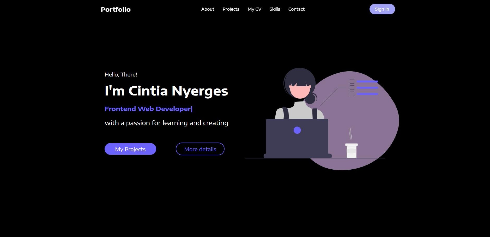

# Portfolio

## Getting Started 

To start the website please write the followings to your terminal: 

1.) npm init -y  
2.) npm start

## Scope of the project

The aim of the project was showing my React skill by a Portfolio. I used styled components, animated blobs and typical npm package as well.

